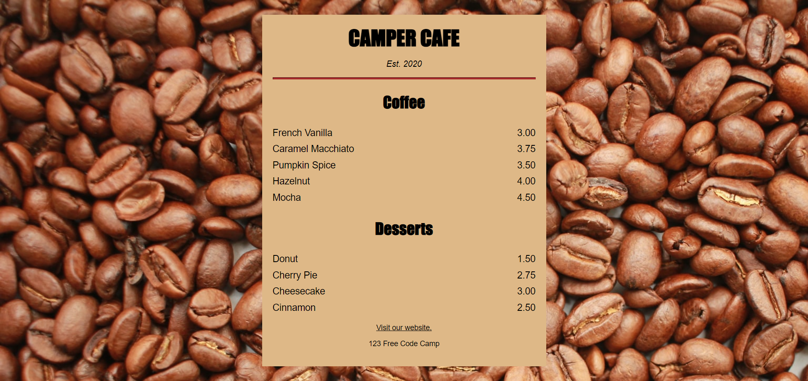
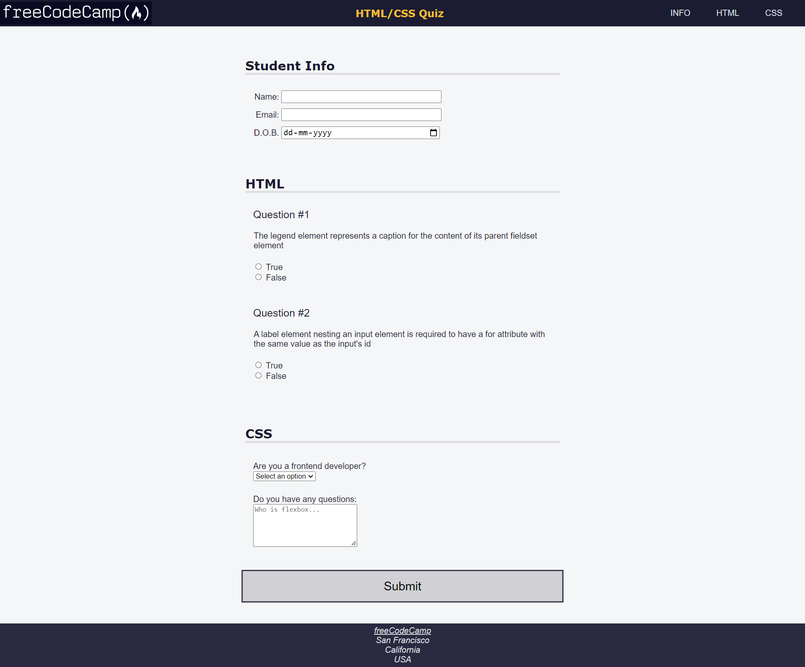
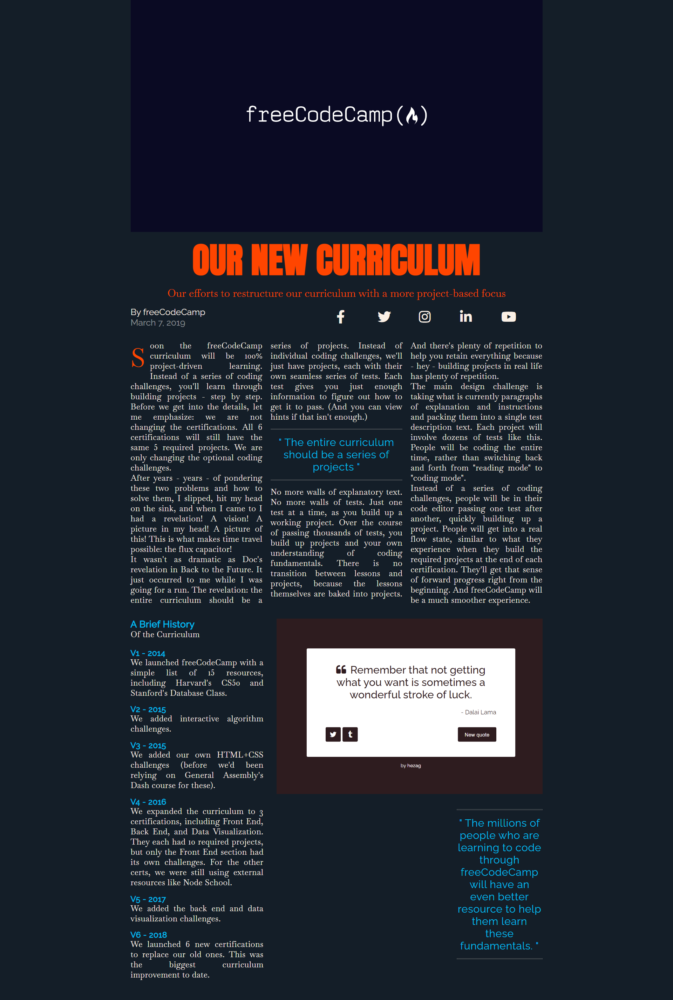
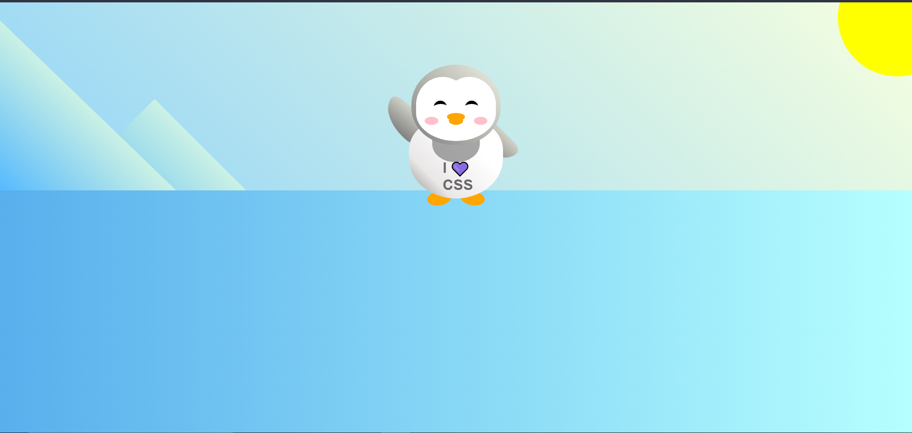
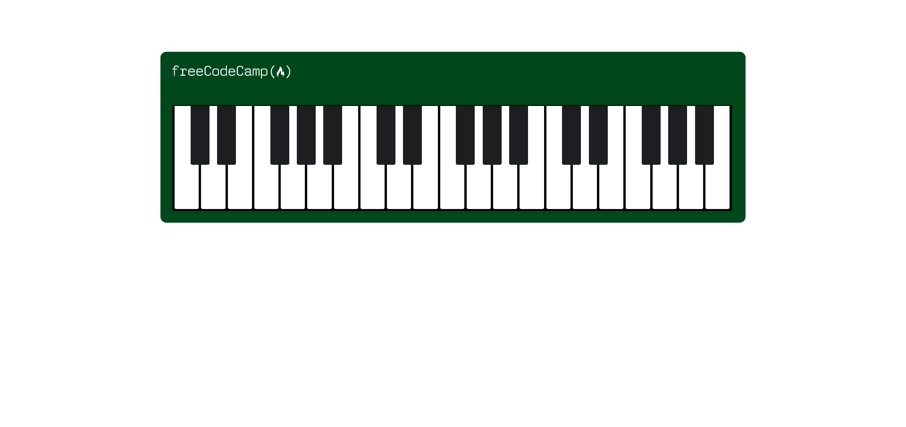
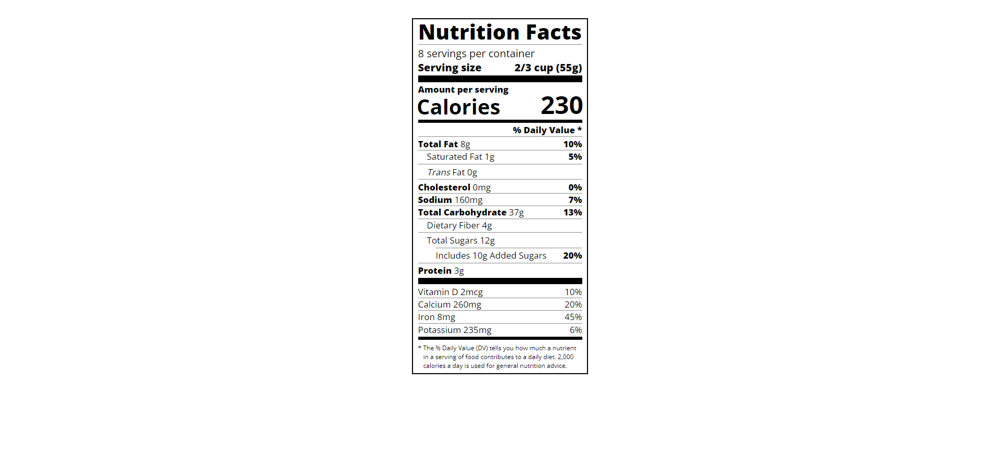

# FreeCodeCamp Practice Projects
This projects technically have been coded by me but instructions given from FreeCodeCamp site. This section is divided in two parts HTML and CSS where in HTML it focuses mostly on HTML with little CSS and in CSS each differnet project focuses on differnt CSS properties.
## [HTML](./HTML/)
### [Menu](./HTML/Menu/) 

### [Registration Form](./HTML/Registration%20Form/)

## [CSS](./CSS/)
### [Accessibility](./CSS/Accessibility/)

### [Box Model](./CSS/Box%20Model/) 

### [Ferris Wheel](./CSS/Ferris%20Wheel/) 

### [Grid](./CSS/Grid/) 

### [Penguin](./CSS/Penguin/) 

### [Piano](./CSS/Piano/) 

### [Picasso Painting](./CSS/Picasso%20Painting/) 

### [Pseudo Selector](./CSS/Pseudo%20Selector/) 

### [Skyline](./CSS/Skyline/)
   a) Light Mode 
   b) Dark Mode 
### [Typography](./CSS/Typography/) 

